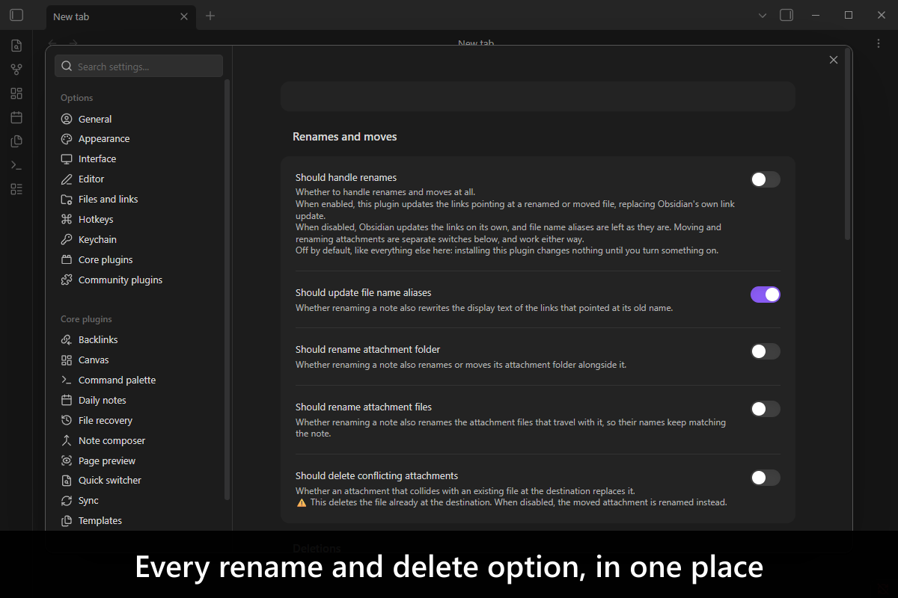
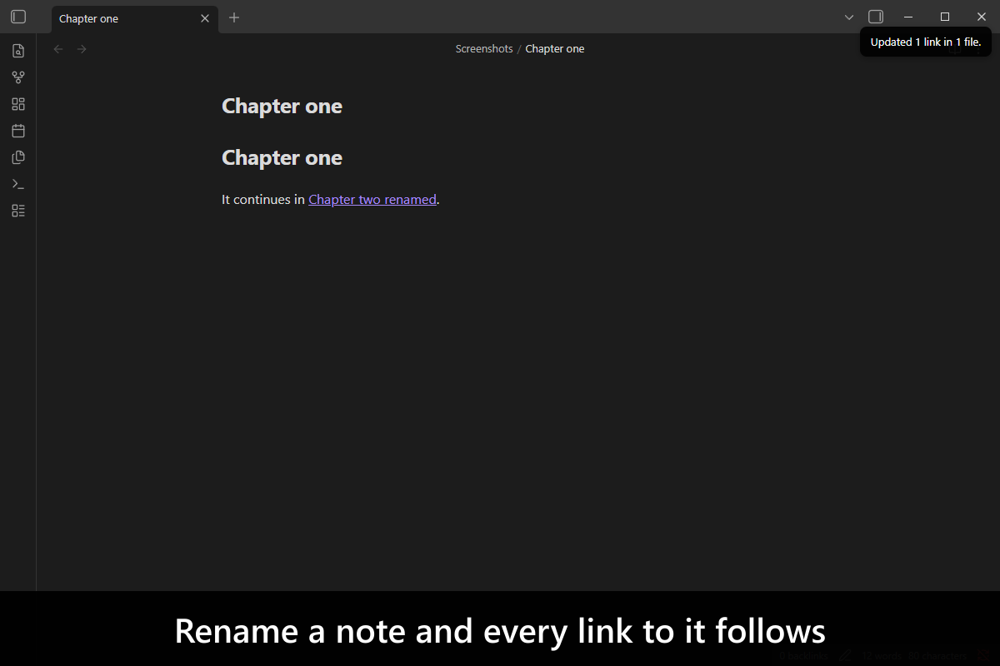
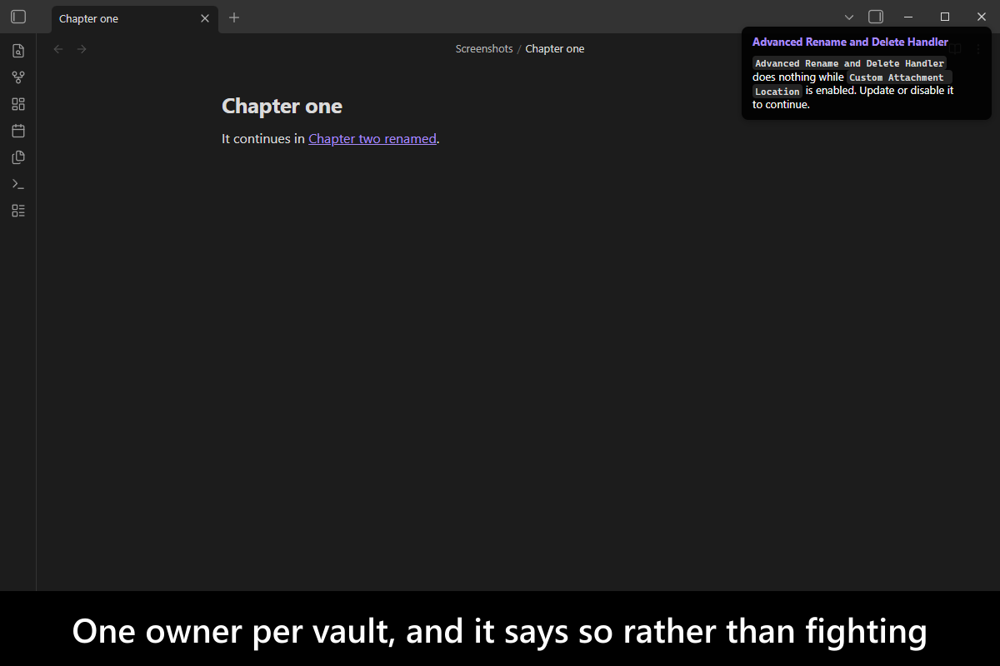
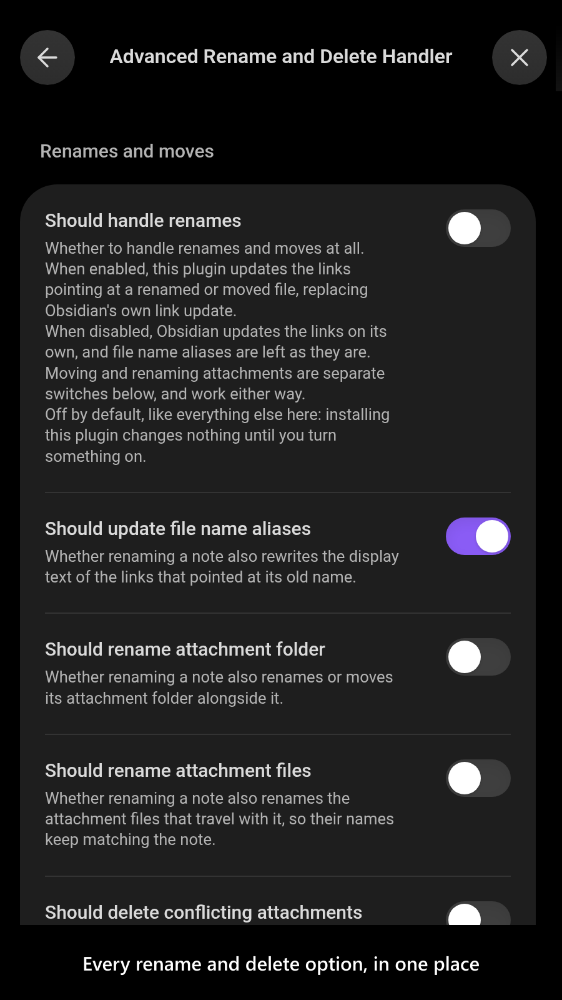
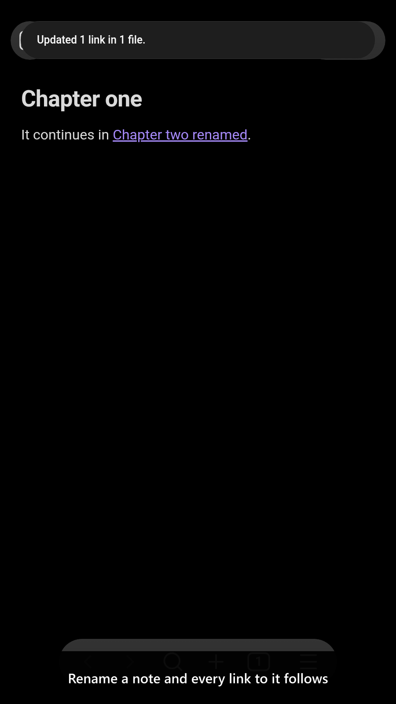

# Advanced Rename and Delete Handler

[](https://www.buymeacoffee.com/mnaoumov) [](https://github.com/mnaoumov/obsidian-advanced-rename-and-delete-handler/releases) [](https://github.com/mnaoumov/obsidian-advanced-rename-and-delete-handler/releases) [](https://github.com/mnaoumov/obsidian-advanced-rename-and-delete-handler)

[Obsidian](https://obsidian.md/) updates the links pointing at a note when you rename it, and stops there. The images you pasted into that note stay behind under the old name. Deleting the note leaves them behind entirely, referenced by nothing, in a folder named after something that no longer exists.

This plugin takes over renaming and deleting for the whole vault: links follow the note, the files it owns travel with it, and what a deletion leaves behind is cleaned up on terms you choose.

**It is the single owner of that behavior in a vault.** Several plugins used to carry their own copy of this handler, and two handlers acting on one rename corrupt links between them. Rather than compete, this plugin checks on load and refuses to run while a plugin that still owns its own handler is installed, naming the ones to update; once they are, it starts on its own.

<!-- markdownlint-disable MD033 -->

<a href="https://github.com/mnaoumov/obsidian-advanced-rename-and-delete-handler/blob/HEAD/images/screenshots/screenshot-desktop-1.png"></a>

<details>
<summary>More screenshots</summary>

<div>
<a href="https://github.com/mnaoumov/obsidian-advanced-rename-and-delete-handler/blob/HEAD/images/screenshots/screenshot-desktop-2.png"></a>
<a href="https://github.com/mnaoumov/obsidian-advanced-rename-and-delete-handler/blob/HEAD/images/screenshots/screenshot-desktop-3.png"></a>
<a href="https://github.com/mnaoumov/obsidian-advanced-rename-and-delete-handler/blob/HEAD/images/screenshots/screenshot-mobile-1.png"></a>
<a href="https://github.com/mnaoumov/obsidian-advanced-rename-and-delete-handler/blob/HEAD/images/screenshots/screenshot-mobile-2.png"></a>
</div>

</details>

<!-- markdownlint-enable MD033 -->

## Demo vault

**The documentation is a demo vault.** Every feature has a note that explains what it does and why you would want it, with buttons that perform the rename or the deletion and then print the vault as a tree, so you see the effect rather than read a description of it.

**[Start reading here](<./demo-vault/00 Start.md>)** — it is plain markdown, so it works on GitHub with nothing installed.

A copy of the vault ships with every release. You can access it via any of the following:

1. Running the **Advanced Rename and Delete Handler: Open demo vault** command.
2. Downloading `advanced-rename-and-delete-handler-demo-vault-<version>.zip` (`<version>` is the release version) from the [Releases](https://github.com/mnaoumov/obsidian-advanced-rename-and-delete-handler/releases).
3. Browsing its source in [`demo-vault/`](./demo-vault/README.md) in this repository.

## What it does

- **Links follow a renamed or moved note**, including the display text of a link that was showing the old file name — while a link somebody gave their own words to is left alone. [01 Renaming a note](<./demo-vault/01 Renaming a note.md>)
- **Attachments travel with the note that owns them**, folder and all, when it is renamed or moved to another folder. [01 Renaming a note](<./demo-vault/01 Renaming a note.md>)
- **Deleting a note can clean up after it** — the attachments only that note used, and the folder the deletion leaves empty. Off by default, because each option removes something. [02 Deleting a note](<./demo-vault/02 Deleting a note.md>)
- **An attachment two notes share is never deleted with one of them**, and can be moved to the note that still uses it rather than left in a folder belonging to a note that is gone. [03 Shared attachments](<./demo-vault/03 Shared attachments.md>)
- **A drawing stored as `.excalidraw.md` is treated as an attachment, not a note**, along with any other ending you add. [04 What counts as a note](<./demo-vault/04 What counts as a note.md>)
- **The plugin can be confined to part of the vault** with include and exclude path lists. [05 Limiting the scope](<./demo-vault/05 Limiting the scope.md>)

## For plugin developers: handing your settings over

A plugin that used to handle renames and deletions itself, and no longer does, can propose the settings it held so a vault keeps behaving the way it did. This plugin owns those settings, so it owns the dialog too: your proposal is shown next to the current values, and the user approves, edits or declines it row by row. Nothing is written unless they press OK.

The API is published through the `obsidian-dev-utils` cross-plugin registry, which gives you version negotiation, a handle that is revoked when this plugin unloads, and a wait that ends when this plugin loads — rather than a lookup that returns `undefined` because it ran first.

```ts
import { watchPluginApi } from 'obsidian-dev-utils/obsidian/plugin/plugin-api';

const ref = watchPluginApi<AdvancedRenameAndDeleteHandlerApi>({
  apiVersionRange: '^1',
  app: this.app,
  component: this,
  pluginId: 'advanced-rename-and-delete-handler'
});

const api = await ref.whenAvailable();
const result = await api.migrateSettings({
  proposedSettings: {
    shouldHandleRenames: true,
    treatAsAttachmentExtensions: ['.excalidraw.md']
  },
  sourcePluginId: this.manifest.id
});

if (result.isApplied) {
  // Record your own one-shot flag, so the offer is not repeated.
}
```

- **`proposedSettings`** names only what you held. Every member is optional, and a proposal that matches what this plugin already holds is dropped rather than shown, so a user is never asked about a row that would change nothing.
- **`result.isApplied`** is `false` when the user cancelled and nothing was written — do NOT record your migration as done in that case. It is `true` when they approved, and also when the proposal changed nothing and no dialog was needed.
- **The call resolves only once the dialog is closed**, so awaiting it is how you learn the answer. Two plugins proposing at once are queued, never stacked.
- **A value of the wrong type is refused** rather than written, so a mistake surfaces as an error instead of a corrupted `data.json`.
- The settings you may propose are `emptyFolderBehavior`, `excludePaths`, `includePaths`, `notePriorities`, `shouldDeleteConflictingAttachments`, `shouldHandleDeletions`, `shouldHandleRenames`, `shouldRenameAttachmentFiles`, `shouldRenameAttachmentFolder`, `shouldRescueSharedAttachments`, `shouldUpdateFileNameAliases` and `treatAsAttachmentExtensions`.
- The contract version is `1.0.0` and moves independently of the plugin's own version. Ask for `'^1'`.
- If you cannot depend on a library version that has the registry, the same object is on the plugin instance as `app.plugins.plugins['advanced-rename-and-delete-handler']?.api` — untyped, and `null` until this plugin has loaded.

## Installation

The plugin is not yet listed in [the official Community Plugins repository](https://community.obsidian.md/plugins). Until it is, install it as a beta release.

### Beta versions

To install the latest beta release of this plugin (regardless if it is available in [the official Community Plugins repository](https://community.obsidian.md) or not), follow these steps:

1. Ensure you have the [BRAT plugin](https://community.obsidian.md/plugins/obsidian42-brat) installed and enabled.
2. Click [Install via BRAT](https://intradeus.github.io/http-protocol-redirector?r=obsidian://brat?plugin=https://github.com/mnaoumov/obsidian-advanced-rename-and-delete-handler).
3. An Obsidian pop-up window should appear. In the window, click the `Add plugin` button once and wait a few seconds for the plugin to install.

## Debugging

By default, debug messages for this plugin are hidden.

To show them, run the following command:

```js
window.DEBUG.enable('advanced-rename-and-delete-handler');
```

For more details, refer to the [documentation](https://mnaoumov.dev/obsidian-dev-utils/guides/debugging/).

## Changelog

All notable changes to this project will be documented in the [CHANGELOG](./CHANGELOG.md).

## Contributing

Contributions are welcome — see [CONTRIBUTING](./CONTRIBUTING.md) to get set up.

## Support

<!-- markdownlint-disable MD033 -->

<a href="https://www.buymeacoffee.com/mnaoumov" target="_blank"></a>

<!-- markdownlint-enable MD033 -->

## My other Obsidian resources

[See my other Obsidian resources](https://github.com/mnaoumov/obsidian-resources).

## License

© [Michael Naumov](https://github.com/mnaoumov/)
